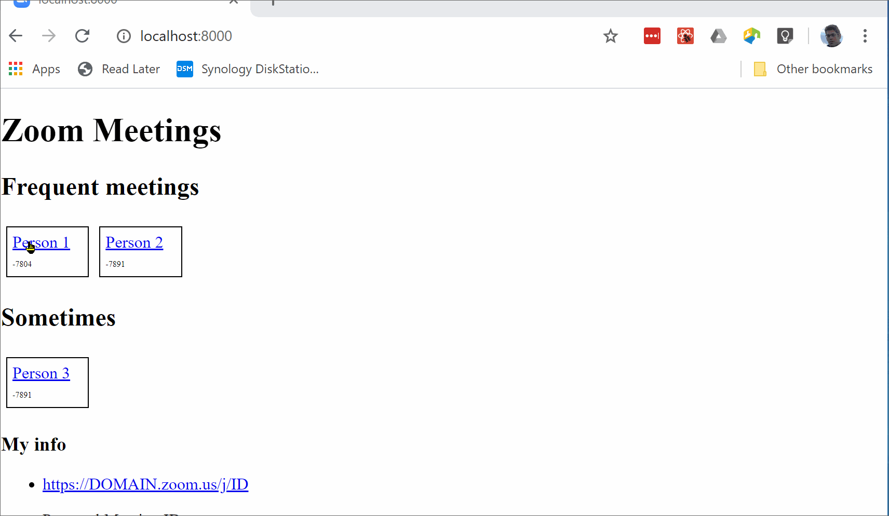

A tool for joining zoom calls with a click (or two)

## Setup

1. [Node](https://nodejs.org/) v12+
1. clone this repo
1. `npm install`
1. edit `gatsby-config.js` - set the `zoomDomain` as needed
1. edit `index.mdx` add the meetings your need
1. `npm start`

## How to use it

1. open http://localhost:8000/
1. Click the link of the meeting you want to join
1. Click **Open Zoom Meeting** on the browser pop-up
1. Paste the password (which is copied by click-to-zoom for you) into the zoom password prompt

## limitations

1. Zoom meetings with custom ids don't open a new browser tab. Instead click the buttons to copy the id/pwd as needed. (fixes welcome!)
